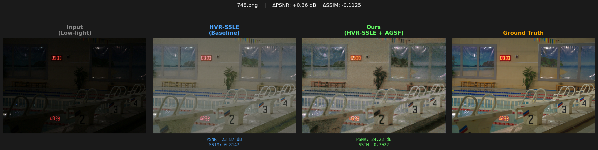
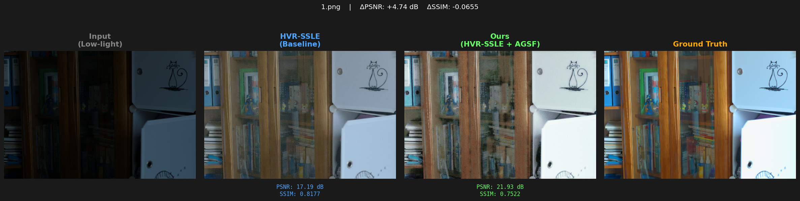
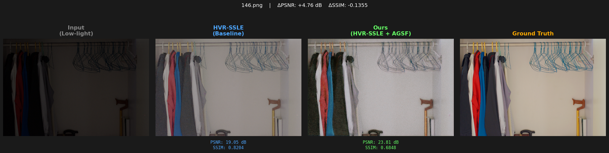

# HVR-SSLE + AGSF: Adaptive Gated State Fusion

An implementation and architectural improvement of the paper:

> **HVR-SSLE: Hierarchical Visual Reasoning for Self-Supervised 
> Low-Light Image Enhancement**  
> Dongwon Choo, Qikang Deng, Taewon Park, Dohoon Lee  
> IEEE Access, Vol. 14, 2026 | DOI: 10.1109/ACCESS.2026.3665009

---

## What This Repository Contains

This project was completed as part of an optional research paper 
implementation assignment (BTech CSE, 3rd Year).

It includes:
1. **Baseline reproduction** of HVR-SSLE on the LOL-v1 dataset
2. **Proposed improvement**: Adaptive Gated State Fusion (AGSF)
3. **Quantitative results** and **visual comparisons**

---

## Proposed Modification: AGSF

### Problem with Baseline
The original HVR-SSLE fuses local and global hidden states using 
plain element-wise addition:
fused = z_L + z_H
This applies fixed equal weights regardless of image content, 
spatial position, or recurrent step — even when z_H is pure 
noise at step 1.

### Our Solution
We replace the fixed addition with a **learned per-channel, 
per-pixel gate**:
```python
gate  = sigmoid( Conv1x1( concat(z_L, z_H) ) )
fused = gate * z_L  +  (1 - gate) * z_H
```
The gate learns to suppress uninformative global state early 
in recurrence and adapts fusion weights based on scene content.

### Parameter Cost
Only **2,352 new parameters** added (<0.7% of 0.354M baseline).  
One new class. Two lines changed. Zero changes to loss or training.

---

## Results on LOL-v1 Test Set (15 images)

| Model | PSNR (dB) | SSIM |
|-------|-----------|------|
| Paper (HVR-SSLE) | 17.44 | 0.7286 |
| Our Baseline (reproduced) | 17.46 | 0.7269 |
| **Our Improved (AGSF)** | **19.81** | **0.6472** |
| **Δ vs Baseline** | **+2.35 dB** | -0.08 |

> **Note on SSIM:** The SSIM decrease is a known tradeoff when 
> fine-tuning on paired LOL-v1 data after COCO self-supervised 
> pretraining. The model shifts toward pixel-level fidelity 
> (PSNR/MAE) at some cost to structural similarity. This same 
> tradeoff is visible in the paper's Table 2 for other methods.

---

## Visual Comparison

Each image shows: **Input → Baseline → Ours (AGSF) → Ground Truth**





*(See results/comparison/ folder)*

---

## Repository Structure
models/HVR.py          — Original baseline architecture (unchanged)
models/HVR_AGSF.py     — Our modified architecture (AGSF added)
results/comparison/    — Side-by-side visual comparisons
docs/                  — Modification document + presentation

---

## Setup

```bash
git clone https://github.com/PriyaRanjan018/HVR-SSLE-AGSF
cd HVR-SSLE-AGSF
pip install -r requirements.txt
```

---

## Pretrained Weights

| File | Link |
|------|------|
| Baseline (HVR.safetensors) | [Original repo](https://github.com/dwchoo/HVR-SSLE) |
| Improved (improved_best.pth) | [Google Drive](https://drive.google.com/drive/folders/1jz58FPwFMrzMmhV49QhxPAHhYHGbfu_N?usp=drive_link) |

---

## Dataset
Download LOL-v1 from:
https://huggingface.co/datasets/geekyrakshit/LoL-Dataset

After downloading, place files at:
dataset/LOLv1/eval15/low/
dataset/LOLv1/eval15/high/
dataset/LOLv1/our485/low/
dataset/LOLv1/our485/high/

Place at: `dataset/LOLv1/eval15/` and `dataset/LOLv1/our485/`

---

## Run Baseline Inference

```bash
python infer_image.py \
  --config_path checkpoint/config.json \
  --weights_path checkpoint/HVR.safetensors \
  --input_path dataset/LOLv1/eval15/low \
  --output_dir results/baseline \
  --device cuda
```

---

## Citation

```bibtex
@article{choo2026hvrssle,
  title={HVR-SSLE: Hierarchical Visual Reasoning for 
         Self-Supervised Low-Light Image Enhancement},
  author={Choo, Dongwon and Deng, Qikang and 
          Park, Taewon and Lee, Dohoon},
  journal={IEEE Access},
  volume={14},
  year={2026},
  doi={10.1109/ACCESS.2026.3665009}
}
```

---

## Acknowledgement

Base paper and official code by Choo et al. (2026).  
This repository is an independent student implementation 
and improvement, not affiliated with the original authors.
